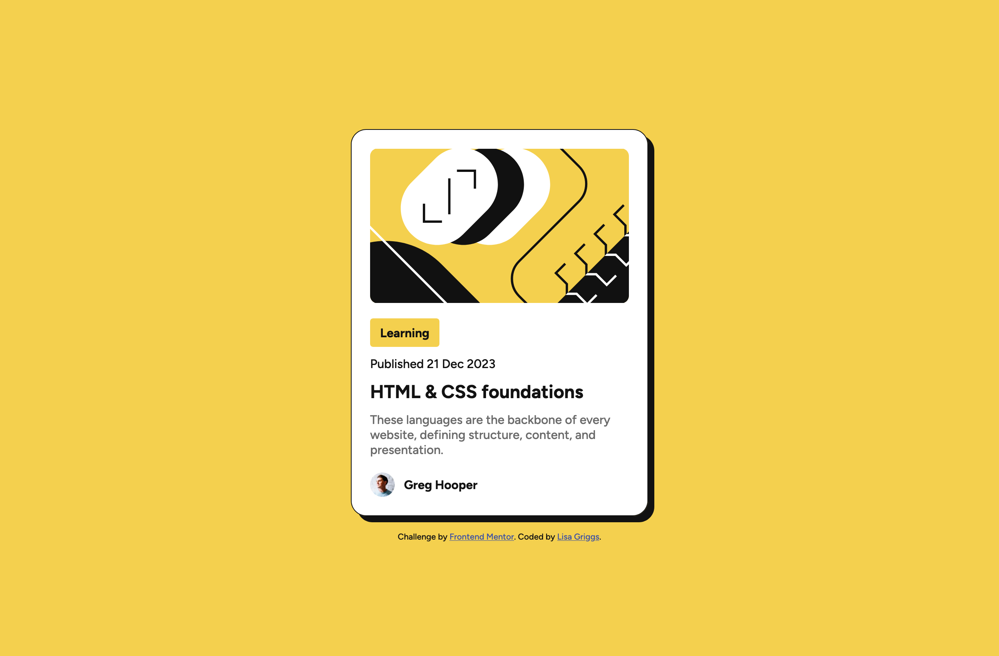

# Frontend Mentor - Blog preview card solution

This is a solution to the [Blog preview card challenge on Frontend Mentor](https://www.frontendmentor.io/challenges/blog-preview-card-ckPaj01IcS). Frontend Mentor challenges help you improve your coding skills by building realistic projects. 

## Table of contents

- [Overview](#overview)
  - [The challenge](#the-challenge)
  - [Screenshot](#screenshot)
  - [Links](#links)
- [My process](#my-process)
  - [Built with](#built-with)
  - [What I learned](#what-i-learned)
  - [Continued development](#continued-development)
- [Author](#author)


**Note: Delete this note and update the table of contents based on what sections you keep.**

## Overview

### The challenge

The challenge is to build out this blog preview card and get it looking as close to the design as possible.

Should be able to:
- See hover and focus states for all interactive elements on the page

### Screenshot



### Links

- Solution URL: [Add solution URL here](https://your-solution-url.com)
- Live Site URL: [Add live site URL here](https://your-live-site-url.com)

## My process

### Built with

- Semantic HTML5 markup
- CSS custom properties
- Flexbox
- Visual Studio Code


### What I learned

Building up my HTML and CSS experience more with this project. Included the CSS within the HTML document so it's easier to viewability, instead of a styles.css file for this project. 

Learnt more about Semantic HTML as I would always use divs in the past because experience from other web designers. I also used IDs since this is a dedicated project, but if more cards were involved, then I would use Classes instead to target multiple elements.

**Note: Delete this note and the content within this section and replace with your own learnings.**

### Continued development

```Coming soon ```

## Author

- Frontend Mentor - [@lisagriggs](https://www.frontendmentor.io/profile/lisagriggs)
